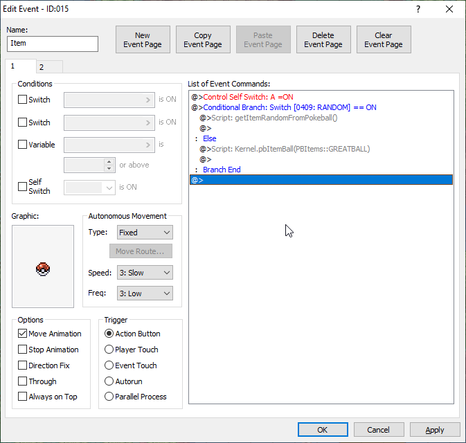
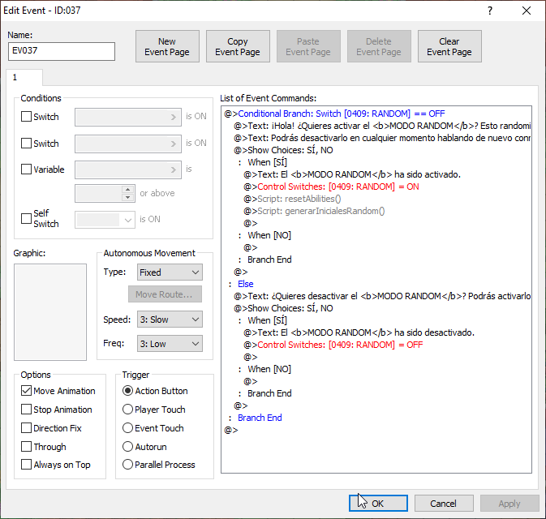
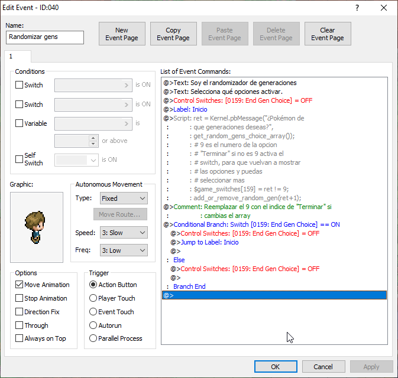

# Modo Random

## Descripción

El modo random randomizará ataques y habilidades de los pokémon tanto de entrenadores como de los salvajes, se puede activar que también se randomice la compatibilidad con las MTs, se podrá restringir las generaciones de los pokémon que apareceran en el random.

El random es progresivo en base a la cantidad de medallas del jugador, entre más medallas tenga salen pokémon con más BST, aquí dejo la formula, que la pueden modificar en el metodo `getMaxBSTCap` y `getMinBSTCap`

- 0 y 1 medalla BST min 0 y BST max 400
- 2 medallas BST min 0 y BST max 440
- 3 medallas BST min 350 y BST max 480
- 4 medallas BST min 375 y BST max 520
- 5 medallas BST min 400 y BST max 560
- 6 medallas BST min 425 y BST max 600
- Más de 6 medallas BST min 440 y BST max 800

También si el jugador tiene menos de 3 medallas no pueden salir movimientos con más de 70 de poder base.

Si se quiere deshabilitar la progresivadad del random hay que poner la variable `PROGRESSIVE_RANDOM` del script `Random.rb` en `false`

Se puede hacer que los pokémon iniciales salgan de un listado definido por el maker, para se debe actualizar el script `Random.rb` en la variable `ListaStartersRandomizado` se deben separar los Pokémon por comas, por ejemplo `[PBSpecies::BULBASAUR,PBSpecies::CHARMANDER,PBSpecies::SQUIRTLE, PBSpecies::PIDGEY,PBSpecies::NIDORANmA,PBSpecies::NIDORANfE,PBSpecies::ZUBAT,PBSpecies::MANKEY,PBSpecies::POLIWAG, PBSpecies::ABRA]`
Si este listado está vacío los iniciales serán 100% random respetando las restricciones de generaciones, BST y blacklist de pokémon.

También se pueden randomizar los objetos obtenidos, para eso en los eventos que dan objetos hay que checkear si el switch del random está activo, si lo está en lugar de llamar a pbItemBall, hay que llamar `getItemRandomFromPokeball()` abajo dejo un ejemplo de como hacerlo.


En el script `ObjetosRandom.rb` hay una variable `BLACK_LIST` que contiene los objetos que no se pueden obtener, del evento de arriba, si se quiere restringir más de un objeto se debe separar por comas, por ejemplo `[:LOPUNNYTE, :SACREDASH, :BLACKFLUTE]`

También hay una variable `MTLIST_RANDOM` que debe contener las MTs, para que si el objeto que se randomizó es una MT que ya tienes se genere otra MT distinta, las distintas MTs se deben separar por comas, por ejemplo `[:TM01, :TM02, :TM03]`

### Configuraciones Base

- Si quieres desactivar el randomizado de los movimientos, en el script `Random.rb` hay una variable que se llama `RANDOM_MOVES_DEFAULT_VALUE` por defecto está en `true` si la cambias a `false` no se randomizarán los movimientos
- Si quieres activar el randomizado de la compatibilidad con las MTs, en el script `Random.rb` hay una variable que se llama `RANDOM_TM_COMPAT` por defecto está en `false` si la cambias a `true` se randomizará la compatibilidad con las MTs
- Se puede restringir qué pokémon salen en el random, para eso se debe modificar el script `Random.rb` en la variable `BlackListedPokemon` si se quiere restringir más de un pokémon se debe separar por comas, por ejemplo `[PBSpecies::ARTICUNO,PBSpecies::MOLTRES, PBSpecies::ZAPDOS]`
- Se puede restringir qué habilidades salen en el random, para eso se debe modificar el script `Random.rb` en la variable `ABILITYBLACKLIST` si se quiere restringir más de una habilidad se debe separar por comas, por ejemplo `[PBAbilities::IMPOSTER, PBAbilities::ZENMODE, PBAbilities::WONDERGUARD]`
- Se pueden restringir qué movimientos salen en el random, para eso se debe modificar el script `Random.rb` en la variable `MOVEBLACKLIST` si se quiere restringir más de un movimiento se debe separar por comas, por ejemplo `[PBMoves::CHATTER, PBMoves::DIG, PBMoves::TELEPORT, PBMoves::SONICBOOM, PBMoves::DRAGONRAGE, PBMoves::STRUGGLE]`
- Si quieres desactivar que el random sea progresivo, en el script `Random.rb` hay una variable que se llama `PROGRESSIVE_RANDOM_DEFAULT_VALUE` por defecto está en `true` si la cambias a `false`, el random no será progresivo, por lo que desde la ruta 1 te podrian salir Pokémons legendarios a menos que esten inluídos en la blacklist
- Se puede elegir como funciona el random de las habilidades, si es 100% random por especie o si mapea una habilidad a otra, o directamente no randomizar las habilidades.
  Unos ejemplos:
  - **Opción 1:** 100% random -> Para esta opcion hay que poner la constante `FULL_RANDOM_ABS` que está en el script `Random.rb` en `true`
  Ejemplo Pikachu tendra Intimidación y Cura Natural, pero Raichu podría tener otras distintas, como Absorbe agua y levitación
  - **Opción 2:** Mapeo de habilidades -> Para esta opcion hay que poner la constante `MAP_RANDOM_ABS` que está en el script `Random.rb` en `true`
  Ejemplo Intimidación se convierte en Inicio Lento, lo que no significa, que Inicio Lento se convierta en Intimidación
  
  Si ninguna de las 2 constantes está en `true` no se randomizarán las habilidades.
  Si ambas constantes están en `true` se utilizará la opción 1.


### Con la version 1.2.0

Hay varias mejoras, ahora se puede decidir si los movimientos están randomizados o no, se agregaron un total de 7 metodos nuevos para que como maker puedan darle la opcion al jugador de configurar el random a su gusto, estos metodos son:

- are_random_moves_on -> Devuelve si los movimientos están randomizados, esto es mas que nada por si en un evento le quieren informar al usuario el estado de esta opción del random
- toggle_random_moves -> Permite cambiar el estado de los movimientos randomizados, si estaban en true los pone en false y viceversa
- is_progressive_random_on -> Similar al primer metodo, devuelve si la progresividad del random está activa
- toggle_progressive_random -> Permite cambiar el estado de la progresividad del random, si estaba en true lo pone en false y viceversa
- is_random_tm_compat_on -> Similar al primer metodo, devuelve si la compatibilidad con las MTs está randomizada
- toggle_random_tm_compat -> Permite cambiar el estado de la compatibilidad con las MTs, si estaba en true lo pone en false y viceversa
- choose_random_ability_mode -> Permite cambiar el modo de random de las habilidades, recibe en el modo esperado :FULL_RANDOM_ABS para el modo full random (la opcion 1 mencionanda mas arriba) o :MAP_RANDOM_ABS para el modo de mapeo de habilidades (la opcion 2 mencionanda mas arriba)
  Tengan en cuenta de que cambiar el modo de las habilidades las regenerará, por lo que si el jugador ya tiene un pokémon con habilidades randomizadas, estas se perderán

Si creo el metodo enable_random para facilitar la activacion del random, en el evento solo llamán a este metodo y el random se activará con las opciones que se hayan predefinido en el script, las opciones que se pueden predefinir son:

- `FULL_RANDOM_ABS = true` o `MAP_RANDOM_ABS = true` -> Esto determina el modo de random de las habilidades, si no se predefine ninguna de estas constantes, las habilidades no se randomizarán, si ambas están en true se utilizará la opcion 1
- `PROGRESSIVE_RANDOM_DEFAULT_VALUE = true o false` -> Esto determina si la progresividad del random está activa, el usuario podría cambiar esta opción si le crean un evento que llame al método toggle_progressive_random
- `RANDOM_MOVES_DEFAULT_VALUE = true o false` -> Esto determina si los movimientos están randomizados, el usuario podría cambiar esta opción si le crean un evento que llame al método toggle_random_moves
- `RANDOM_TM_COMPAT_DEFAULT_VALUE = true o false` -> Esto determina si la compatibilidad con las MTs está randomizada, el usuario podría cambiar esta opción si le crean un evento que llame al método toggle_random_tm_compat

Los valores por defecto para estas constantes son:

- `FULL_RANDOM_ABS = true`
- `MAP_RANDOM_ABS = false`
- `PROGRESSIVE_RANDOM_DEFAULT_VALUE = true`
- `RANDOM_MOVES_DEFAULT_VALUE = true`
- `RANDOM_TM_COMPAT_DEFAULT_VALUE = false`

## Implementación

1. Descargar el zip "ModoRandom.zip" desde [aquí](https://github.com/Pokemon-Fan-Games/ModoRandom/releases/download/v1.2.0/ModoRandom.zip)
3. Crear los 3 scripts que están en el zip, arriba del script Main
4. Crear el siguiente NPC para activar el modo random

   1. Se debe agregar una sentencia de tipo script que llame al método `enable_random`
   2. El NPC también podría desactivar el random, solo tiene que desactivar el switch

   **Ejemplo del evento que activa/desactiva el random**
   

5. Crear un NPC para que el jugador pueda limitar las generaciones de Pokémon que salen en el random

   _Nota: Saldrán Pokémon de las generaciones elegidas y evoluciones que hayan salido en gens posteriores, eligiendo la gen 1 podría salir por ejemplo un Magnezone_

   

   Codigo del script del evento:

   ```ruby
    ret = Kernel.pbMessage("¿Pokémon de
    que generaciones deseas?",
    get_random_gens_choice_array());
    # 9 es el numero de la opcion
    # "Terminar" si no es 9 activa el
    # switch, para que vuelvan a mostrar
    # las opciones y puedas
    # seleccionar más
    $game_switches[159] = ret != 9;
    add_or_remove_random_gen(ret+1);
   ```

### Evento Iniciales

En el evento de los iniciales se debe generar una nueva página con la condición de que el switch del random este activo

1. En el evento hay que agregar una sentencia de tipo script con esta linea `SpeciesIntro.new(pbGet(803)).set_mark_as_seen(false).show` 803 es el id de la variable que se usa para guardar el primer inicial random, para el segundo inicial se usa la variable 804 y para el tercero 805
2. Luego si el jugador confirma que quiere ese inicial

   1. Hay que desactivar el control switch del random
   2. Hay que agregar otra sentencia de tipo script con esta linea `pbAddPokemon(pbGet(803),5)` para que se le asigne el inicial random que se generó al activar el random y que el jugador no pueda reiniciar hasta que le salga el inicial que quiere
   3. Luego hay que volver a activar el switch del random

      Aquí dejo un ejemplo del evento, las partes importantes están marcadas con un cuadro rojo

      
